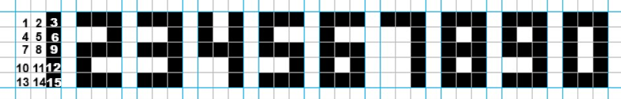
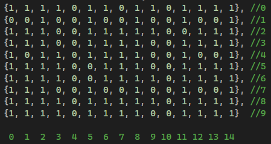
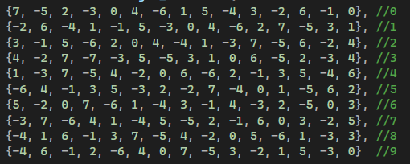

# Теория

Персептрон (англ. perceptron от лат. perceptio — восприятие) —математическая или компьютерная модель восприятия информации мозгом (кибернетическая модель мозга). Чтобы «научить» персептрон классифицировать образы, был разработан специальный итерационный метод обучения проб и ошибок — метод коррекции ошибки.

# Используемые технологии

C++, Visual Studio 2022

# Задача

Необходимо разработать программу для однослойного персептрона и проверить его на помехоустойчивость. Необходимо обучить распознаванию всех цифр, представленных в формате 3x5, рисунок 1. Необходимо добиться того, чтобы все цифры были отличны друг от друга. Для этого имеется обучающая выборка из 500 строк, а каждый столбец содержит двоичный код каждой цифры в соответствии с заданными изначальными значениями. Также имеются десять весов, каждый из которых принадлежит конкретной цифре. В процессе работы будут добавляться помехи (от 0 до 15).

  

# Работа программы

На вход подавались признаки объектов – коды цифр. Код состоит из 15 цифр (0 или 1). 0 – поле цифры на позиции не закрашена. 1 – поле цифры на позиции закрашена.

Для каждого входа подается десять весов. Вес представляет собой степень важности входа. Однако лишь один вес должен принадлежать конкретной цифре.

Сумматор – своего рода «уверенность» нейрона в том, искомый ли перед ним образ. Каждая цифра кода объекта умножается на соответствующее ей значение веса и складывается. Результат – вывод сумматора.

Полученное значение сумматором сравнивается с прочими. Если максимальное значение суммы принадлежит неверной цифре, то вносится штраф. Для верной цифры вес в позициях 1 у распознаваемого образа получает (+ 1), для неверной цифры в этих же позициях вес получает (- 1).

Вводится понятие «помеха». Помеха представляет собой ошибку в обучающей выборке. Всего будет создано от 0 до 15 помех. Помеха вносится в каждую строку, заменяя 0 на 1, а 1 на 0. Тем самым усложняется работа по распознаванию цифры. Останется сравнивать количество ошибок между эпохами. Эпоха, в которой было наименьшее количество ошибок – считается завершающей.
